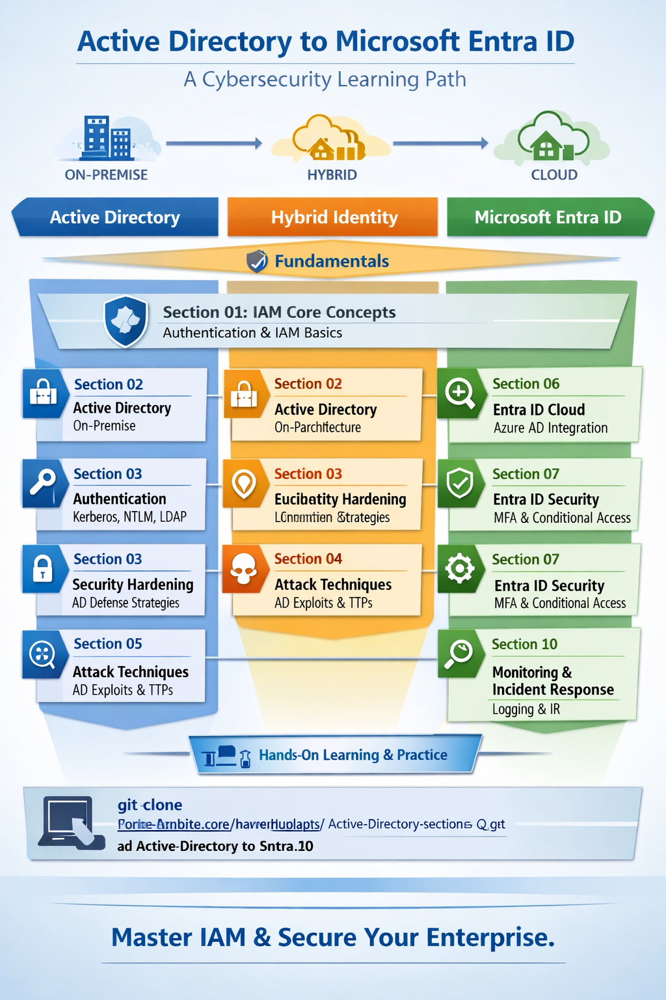

# 🏢 Active Directory to Microsoft Entra ID

**A complete security reference — from on-premise identity infrastructure to cloud IAM.**  
Covers architecture, authentication protocols, attack techniques, defense hardening,  
monitoring, and real-world labs. Written in simple English with real examples.

---

## 🔎 What is this repository about?

Identity is the new security perimeter. As organizations move from **Active Directory** to **Hybrid Identity** and finally to **Microsoft Entra ID**, attackers increasingly target identity systems.  
This repo provides:
- A **structured learning path** from IAM fundamentals to advanced attack techniques.  
- **Hands-on labs** to practice detection, defense, and response.  
- **Interview Q&A** to prepare for cybersecurity roles.  

---

## 🛡️ What is IAM and why does it matter?

**Identity and Access Management (IAM)** ensures the right individuals have the right access to the right resources at the right time.  

From a cybersecurity perspective:
- Enforces **least privilege** and reduces attack surface.  
- Enables **Zero Trust** by verifying every access request.  
- Defends against credential theft, phishing, and privilege escalation.  
- Provides visibility into suspicious activity through **monitoring and logging**.  

---

## 🗺️ Repo Blueprint

  

---

## 🧭 Learning Path

Follow the sections in order to build your expertise:

1. **Fundamentals** → IAM Core Concepts  
2. **Active Directory (On-Premise)** → Architecture, Protocols, Security, Attacks  
3. **Hybrid Identity** → Entra Connect, ADFS, Seamless SSO  
4. **Microsoft Entra ID (Cloud)** → Tenants, Security, Conditional Access  
5. **Monitoring & IR** → Defender for Identity, Sentinel  
6. **Labs & Scenarios** → Hands-on practice and interview prep  

---

## 📂 Sections

*(Your existing tables for Section 01, 02, 03 etc. remain here — no changes needed)*

---

## 📖 How to Use This Repo
