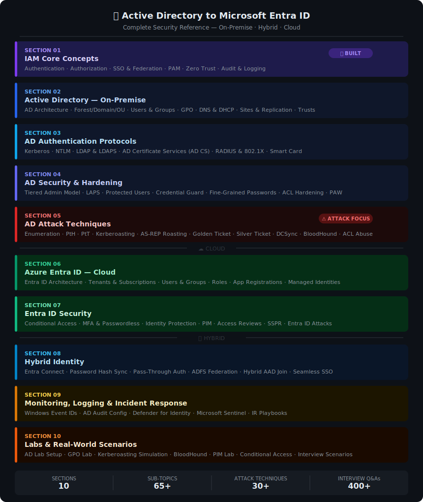

# README

## 🏢 Active Directory to Microsoft Entra ID

**A complete security reference — from on-premise identity infrastructure to cloud IAM.**\
Covers architecture, authentication protocols, attack techniques, defense hardening,\
monitoring, and real-world labs. Written in simple English with real examples.

    

***

### 🔎 What is this repository about?

Identity is the new security perimeter. As organizations move from **Active Directory** to **Hybrid Identity** and finally to **Microsoft Entra ID**, attackers increasingly target identity systems.\
This repo provides:

* A **structured learning path** from IAM fundamentals to advanced attack techniques.
* **Hands-on labs** to practice detection, defense, and response.
* **Interview Q\&A** to prepare for cybersecurity roles.

***

### 🛡️ What is IAM and why does it matter?

**Identity and Access Management (IAM)** ensures the right individuals have the right access to the right resources at the right time.

From a cybersecurity perspective:

* Enforces **least privilege** and reduces attack surface.
* Enables **Zero Trust** by verifying every access request.
* Defends against credential theft, phishing, and privilege escalation.
* Provides visibility into suspicious activity through **monitoring and logging**.

***

### 🗺️ Repo Blueprint

***

### 🧭 Learning Path

Follow the sections in order to build your expertise:

1. **Fundamentals** → IAM Core Concepts
2. **Active Directory (On-Premise)** → Architecture, Protocols, Security, Attacks
3. **Hybrid Identity** → Entra Connect, ADFS, Seamless SSO
4. **Microsoft Entra ID (Cloud)** → Tenants, Security, Conditional Access
5. **Monitoring & IR** → Defender for Identity, Sentinel
6. **Labs & Scenarios** → Hands-on practice and interview prep

***

### 📂 Sections

#### 🟣 Section 01 — IAM Core Concepts

> The foundation. Understand identity before anything else.

| #  | File                                                                       | Topic                        | What's Inside                                          |
| -- | -------------------------------------------------------------------------- | ---------------------------- | ------------------------------------------------------ |
| 01 | [01-Introduction-to-IAM.md](Section-01-IAM-Core/01-Introduction-to-IAM.md) | Introduction to IAM          | Identity types, lifecycle, why IAM failures = breaches |
| 02 | [02-Authentication.md](Section-01-IAM-Core/02-Authentication.md)           | Authentication               | Passwords, hashing, MFA, TOTP, FIDO2, Kerberos, NTLM   |
| 03 | [03-Authorization.md](Section-01-IAM-Core/03-Authorization.md)             | Authorization                | RBAC, ABAC, DAC, MAC — access control models           |
| 04 | [04-SSO-and-Federation.md](Section-01-IAM-Core/04-SSO-and-Federation.md)   | SSO & Federation             | SAML, OAuth 2.0, OIDC, Golden SAML                     |
| 05 | [05-PAM.md](Section-01-IAM-Core/05-PAM.md)                                 | Privileged Access Management | JIT, vaulting, LAPS, gMSA, CyberArk, PIM               |
| 06 | [06-Zero-Trust.md](Section-01-IAM-Core/06-Zero-Trust.md)                   | Zero Trust Architecture      | Never trust always verify — 5 pillars                  |
| 07 | [07-Audit-and-Logging.md](Section-01-IAM-Core/07-Audit-and-Logging.md)     | Audit & Logging              | Event IDs, SIEM, KQL queries, detection                |

***

#### 🔵 Section 02 — Active Directory (On-Premise)

> How Windows domain environments are built and managed.

| #  | File                                                                                     | Topic                         | What's Inside                                    |
| -- | ---------------------------------------------------------------------------------------- | ----------------------------- | ------------------------------------------------ |
| 01 | [01-What-is-AD.md](Section-02-Active-Directory/01-What-is-AD.md)                         | What is Active Directory      | Purpose, components, FSMO roles, NTDS.dit        |
| 02 | [02-Forest-Domain-OU.md](Section-02-Active-Directory/02-Forest-Domain-OU.md)             | Forest, Domain & OU Structure | Hierarchy, Global Catalog, DN, design            |
| 03 | [03-Users-Groups-Computers.md](Section-02-Active-Directory/03-Users-Groups-Computers.md) | Users, Groups & Computers     | Group types, AGDLP, UAC flags, AdminSDHolder     |
| 04 | [04-Group-Policy-GPO.md](Section-02-Active-Directory/04-Group-Policy-GPO.md)             | Group Policy (GPO)            | LSDOU, inheritance, scripts, GPO attacks         |
| 05 | [05-DNS-and-DHCP.md](Section-02-Active-Directory/05-DNS-and-DHCP.md)                     | DNS & DHCP in AD              | SRV records, DORA, authorisation, attacks        |
| 06 | [06-Sites-and-Replication.md](Section-02-Active-Directory/06-Sites-and-Replication.md)   | Sites, Subnets & Replication  | KCC, intra vs intersite, repadmin                |
| 07 | [07-AD-Trusts.md](Section-02-Active-Directory/07-AD-Trusts.md)                           | AD Trusts                     | Trust types, SID filtering, delegation risk      |
| 08 | [08-AD-Recycle-Bin.md](Section-02-Active-Directory/08-AD-Recycle-Bin.md)                 | AD Recycle Bin & Recovery     | Recycle Bin, DSRM, backup, authoritative restore |

***

#### 🔵 Section 03 — AD Authentication Protocols

> How authentication actually works under the hood.

| #  | File                                                                          | Topic                   | What's Inside                                      |
| -- | ----------------------------------------------------------------------------- | ----------------------- | -------------------------------------------------- |
| 01 | [01-Kerberos.md](Section-03-AD-Auth-Protocols/01-Kerberos.md)                 | Kerberos                | TGT flow, SPN config, Kerberoasting, Golden Ticket |
| 02 | [02-NTLM.md](Section-03-AD-Auth-Protocols/02-NTLM.md)                         | NTLM                    | Challenge-response, Pass-the-Hash, NTLM Relay      |
| 03 | [03-LDAP-and-LDAPS.md](Section-03-AD-Auth-Protocols/03-LDAP-and-LDAPS.md)     | LDAP & LDAPS            | Config, LDAP injection, relay attacks              |
| 04 | [04-AD-CS.md](Section-03-AD-Auth-Protocols/04-AD-CS.md)                       | AD Certificate Services | PKI, ESC1-ESC4, Golden Certificate                 |
| 05 | [05-RADIUS-and-8021X.md](Section-03-AD-Auth-Protocols/05-RADIUS-and-8021X.md) | RADIUS & 802.1X         | Wi-Fi/VPN, Evil Twin, 802.1X bypass                |
| 06 | [06-Smart-Card-Auth.md](Section-03-AD-Auth-Protocols/06-Smart-Card-Auth.md)   | Smart Card Auth         | PKINIT flow, badge printing, WHfB                  |

***

#### 🔵 Section 04 — AD Security & Hardening

> Defending and securing AD environments.

| #  | File                                                                                                | Topic              | What's Inside                              |
| -- | --------------------------------------------------------------------------------------------------- | ------------------ | ------------------------------------------ |
| 01 | [01-Tiered-Admin-Model.md](Section-04-AD-Security/01-Tiered-Admin-Model.md)                         | Tiered Admin Model | Tier 0/1/2 separation, privileged accounts |
| 02 | [02-LAPS.md](Section-04-AD-Security/02-LAPS.md)                                                     | LAPS               | Secure local admin passwords               |
| 03 | [03-Credential-Guard.md](Section-04-AD-Security/03-Credential-Guard.md)                             | Credential Guard   | Protect LSASS secrets                      |
| 04 | [04-Privileged-Access-Workstations.md](Section-04-AD-Security/04-Privileged-Access-Workstations.md) | PAWs               | Hardened admin workstations                |
| 05 | [05-Secure-Delegation.md](Section-04-AD-Security/05-Secure-Delegation.md)                           | Secure Delegation  | Constrained & resource-based delegation    |

***

#### 🔴 Section 05 — AD Attack Techniques

> Common attack paths and exploitation techniques.

| #  | File                                                             | Topic         | What's Inside                                 |
| -- | ---------------------------------------------------------------- | ------------- | --------------------------------------------- |
| 01 | [01-Kerberoasting.md](Section-05-AD-Attacks/01-Kerberoasting.md) | Kerberoasting | SPN abuse, cracking service tickets           |
| 02 | [02-Golden-Ticket.md](Section-05-AD-Attacks/02-Golden-Ticket.md) | Golden Ticket | Forging TGTs with KRBTGT hash                 |
| 03 | [03-DCSync.md](Section-05-AD-Attacks/03-DCSync.md)               | DCSync        | Replicating secrets via directory replication |
| 04 | [04-Pass-the-Hash.md](Section-05-AD-Attacks/04-Pass-the-Hash.md) | Pass-the-Hash | NTLM hash reuse                               |
| 05 | [05-BloodHound.md](Section-05-AD-Attacks/05-BloodHound.md)       | BloodHound    | Graph-based privilege escalation mapping      |

***

#### 🟢 Section 06 — Azure Entra ID (Cloud)

> Identity in the cloud.

| #  | File                                                                              | Topic             | What's Inside                   |
| -- | --------------------------------------------------------------------------------- | ----------------- | ------------------------------- |
| 01 | [01-Entra-Tenants.md](Section-06-Azure-EntraID-Cloud/01-Entra-Tenants.md)         | Tenants           | Tenant structure, domains       |
| 02 | [02-Entra-Roles.md](Section-06-Azure-EntraID-Cloud/02-Entra-Roles.md)             | Roles             | Built-in roles, custom roles    |
| 03 | [03-App-Registrations.md](Section-06-Azure-EntraID-Cloud/03-App-Registrations.md) | App Registrations | Service principals, OAuth flows |

***

#### 🟢 Section 07 — Entra ID Security

> Securing cloud identity.

| #  | File                                                                                | Topic                       | What's Inside                      |
| -- | ----------------------------------------------------------------------------------- | --------------------------- | ---------------------------------- |
| 01 | [01-Conditional-Access.md](Section-07-Entra-ID-Security/01-Conditional-Access.md)   | Conditional Access          | Policies, risk-based access        |
| 02 | [02-MFA.md](Section-07-Entra-ID-Security/02-MFA.md)                                 | Multi-Factor Authentication | Methods, enforcement               |
| 03 | [03-Identity-Protection.md](Section-07-Entra-ID-Security/03-Identity-Protection.md) | Identity Protection         | Risk detection, automated response |

***

#### 🟢 Section 08 — Hybrid Identity

> Bridging on-prem and cloud.

| #  | File                                                                      | Topic           | What's Inside                                                 |
| -- | ------------------------------------------------------------------------- | --------------- | ------------------------------------------------------------- |
| 01 | [01-Entra-Connect.md](Section-08-Hybrid-Identity/01-Entra-Connect.md)     | Entra Connect   | Sync users, password hash sync, writeback options             |
| 02 | [02-ADFS-Federation.md](Section-08-Hybrid-Identity/02-ADFS-Federation.md) | ADFS Federation | Claims-based authentication, token issuance, federation trust |
| 03 | [03-Seamless-SSO.md](Section-08-Hybrid-Identity/03-Seamless-SSO.md)       | Seamless SSO    | Integrated Windows authentication, Kerberos-based SSO         |

***

#### 🟡 Section 09 — Monitoring & Incident Response

> Detecting and responding to identity threats.

| #  | File                                                                                        | Topic                 | What's Inside                                                  |
| -- | ------------------------------------------------------------------------------------------- | --------------------- | -------------------------------------------------------------- |
| 01 | [01-Event-IDs.md](Section-09-Monitoring-Logging-IR/01-Event-IDs.md)                         | Event IDs             | Key AD/Entra logs, authentication events, replication events   |
| 02 | [02-Defender-for-Identity.md](Section-09-Monitoring-Logging-IR/02-Defender-for-Identity.md) | Defender for Identity | Threat detection, lateral movement alerts, suspicious activity |
| 03 | [03-Sentinel.md](Section-09-Monitoring-Logging-IR/03-Sentinel.md)                           | Microsoft Sentinel    | SIEM integration, KQL queries, playbooks, automated response   |

***

#### 🟠 Section 10 — Labs & Real-World Scenarios

> Hands-on practice and interview prep.

| #  | File                                                                                   | Topic                  | What's Inside                                                      |
| -- | -------------------------------------------------------------------------------------- | ---------------------- | ------------------------------------------------------------------ |
| 01 | [01-Lab-Kerberoasting.md](Section-10-Labs-Scenarios/01-Lab-Kerberoasting.md)           | Kerberoasting Lab      | Attack execution, detection with logs, mitigation strategies       |
| 02 | [02-Lab-Conditional-Access.md](Section-10-Labs-Scenarios/02-Lab-Conditional-Access.md) | Conditional Access Lab | Policy creation, enforcement, bypass attempts                      |
| 03 | [03-Lab-DCSync.md](Section-10-Labs-Scenarios/03-Lab-DCSync.md)                         | DCSync Lab             | Simulating replication abuse, detection with Defender for Identity |
| 04 | [04-Interview-QA.md](Section-10-Labs-Scenarios/04-Interview-QA.md)                     | Interview Q\&A         | 400+ curated questions across IAM, AD, Entra, attacks, defenses    |
| 05 | [05-Real-World-Scenarios.md](Section-10-Labs-Scenarios/05-Real-World-Scenarios.md)     | Real-world Scenarios   | 50+ case studies, incident response exercises, SOC workflows       |

### 📖 How to Use This Repo

***

### 📋 Prerequisites

Before starting labs, ensure you have:

* Basic knowledge of Windows Server & Active Directory
* Access to a test environment (VMs or cloud sandbox)
* Familiarity with PowerShell and command-line tools
* Optional: Azure subscription (free tier works)

***

### 🎓 Microsoft Free Resources

Use Microsoft’s free offerings to perform labs and experiments:

* [**Microsoft Learn**](https://learn.microsoft.com/) → Free guided modules on AD, Entra ID, IAM, and security
* [**Azure Free Account**](https://azure.microsoft.com/free/) → Credits and free services to build labs
* [**Microsoft Entra Free Trial**](https://www.microsoft.com/security/business/microsoft-entra) → Explore Conditional Access, MFA, Identity Protection
* [**Microsoft Security Labs**](https://learn.microsoft.com/security/) → Hands-on exercises for Defender, Sentinel, and IAM

***

### 📜 Certifications Info

This repository helps prepare for:

* **SC-900**: Security, Compliance, and Identity Fundamentals
* **SC-300**: Identity and Access Administrator
* **AZ-104**: Azure Administrator
* **SC-200**: Security Operations Analyst

***

### 🎯 Who This Is For

| Role                   | Most Relevant Sections    |
| ---------------------- | ------------------------- |
| **IT Administrator**   | 02, 03, 04, 06, 08        |
| **SOC Analyst**        | 01, 05, 07, 09            |
| **Penetration Tester** | 03, 05, 07, 08            |
| **Security Engineer**  | 01, 04, 07, 09            |
| **Cloud Engineer**     | 06, 07, 08                |
| **Interview Prep**     | All sections + Section 10 |

***

### 📊 Coverage

| Metric                  | Count |
| ----------------------- | ----- |
| 📂 Sections             | 10    |
| 📄 Sub-topic files      | 65+   |
| ⚠️ Attack techniques    | 30+   |
| 🎯 Interview Q\&As      | 400+  |
| 🔧 Commands & configs   | 200+  |
| 🏢 Real-world scenarios | 50+   |

***

_⭐ Star this repo if you find it useful — it helps others find it too!_
